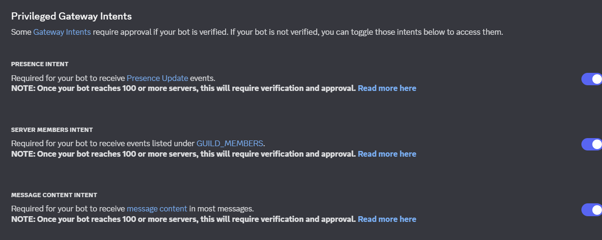

<div align="center">

</div>

<h1 align="center">ErensiBOT</h1>
<div align="center">

[](https://github.com/tooblewtf/ErensiBOT)

ErensiBOT Türkiyenin En Büyük ve En Kaliteli Discord Botudur.
</div>

# UYARI
Lütfen bu botu herkese açık şekilde botunuzda çalistirmayin. Bunun bir kaynak kodu olduğunu ve kendi sisteminizi başlatmak için kullanılabileceğini biliyoruz, ancak yeniden paylaşılması önerilmez bazı nedenlerden dolayı.

Bu repo yalnızca NodeJS ile yapılmış sistemlerin mantığını test etmek veya anlamak amacıyla oluşturulmuştur.

Eğer kendi Discord Botunuzu kurmak istiyorsanız, lütfen kodlamayı öğrenin!
Hazır sistemler yerine, kendi bilginizle bir şeyler inşa etmek her zaman daha sağlıklı ve sürdürülebilirdir.

---

Tabii! Aşağıda README.md dosyasının **Kurulum** bölümünden sonrasını profesyonel ve anlaşılır şekilde geliştirdim. Markdown formatına uygun olarak yazıldı:

---

# KURULUM

Bu botu kurabilmeniz için aşağıdaki adımları takip etmelisiniz:

### 1. Gereksinimler

* **Windows Server 2012 R2 / 2019 / 2022** yüklü bir VDS'e sahip olun.
* **Node.js v24.3.0** sürümünü indirin ve kurun:
  👉 [Node.js İndir (v24.3.0)](https://nodejs.org/dist/v24.3.0/node-v24.3.0-x64.msi)

### 2. Kaynak Kodun İndirilmesi

* Bu repository'yi indir:
  👉 [ErensiBOT İndir (ZIP)](https://github.com/tooblewtf/ErensiBOT/archive/refs/heads/main.zip)

* İndirdiğiniz ZIP dosyasını çıkartın.

* Klasöre girin ve **komut istemcisine (CMD)** şu komutu yazın:

```bash
npm i
```

### 3. config.js Yapılandırması

`config.js` dosyasını açın ve aşağıdaki alanları kendinize göre düzenleyin:

```js
module.exports = {
    token: "BOT_TOKEN_BURAYA",                // Discord Bot tokeni
    prefix: "e!",                              // Bot komut prefix'i
    botdavet: "https://discord.com/oauth2/...",// Bot davet linki
    desteksunucusu: "https://discord.gg/...",  // Destek sunucusu linki
    website: "https://ornekwebsite.com",       // Web siteniz (isteğe bağlı)
    topgg: "TOPGG_API_KEY_BURAYA",             // Top.gg API Key (opsiyonel)
    politika: "https://ornekwebsite.com/tos",  // Hizmet şartları linki
    sunucuid: "DESTEK_SUNUCU_ID",              // Botun destek sunucusunun ID'si
    destekçi: "DestekciGirburaya"               // Destekçi kişi/rol vs.
}
```

> **Not:**
> Bu alanlara koymanız gereken bilgiler:
>
> * **Bot Token** → \[Discord Developer Portal > Bot > Token Kopyala]
> * **Bot Davet Linki** → \[OAuth2 > URL Generator > bot & applications.commands ve administrator izinleri]
> * **Top.gg Key** → \[top.gg panelinizde botunuzu seçip API Key alın]
> * **Sunucu ID** → Sağ tıkla > Sunucu Kimliğini Kopyala (geliştirici modu açık olmalı)

---

### 4. Sahip Bilgisini Ayarlama

`commands/istatistik.js` dosyasını açın ve aşağıdaki kısmı bulun:

```js
.addFields({ name: 'Bot Sahibi', value: `BOT_SAHIBI_BURAYA`, inline: false})
```

Bu alanı **kendi Discord kullanıcı adınızla** değiştirin:
Örnek:

```js
.addFields({ name: 'Bot Sahibi', value: `trklzz`, inline: false})
```

---

### 5. Botu Başlatma

Tüm ayarları yaptıktan sonra bot klasöründe CMD’yi açıp şu komutu girin:

```bash
node index.js
```

> Eğer hata alırsanız, eksik bağımlılık veya yapılandırma hatasını kontrol edin.

---

# KURULUM için ÖNEMLI!!! OKUUU

Botun düzgün çalışabilmesi için **Discord Developer Portal** üzerinden aşağıdaki ayarları yapmalısınız:

### 1. **GATEWAY INTENTS** Ayarları:

Bot sekmesine gelin ve aşağıdaki ayarları **aktif hale getirin**:

* `MESSAGE CONTENT INTENT`
* `SERVER MEMBERS INTENT`
* `GUILD PRESENCE INTENT`

Aksi takdirde bot bazı komutları veya olayları algılamaz.

<div align="center">

</div>

---

# SORUN YAŞARSANIZ?

* Bot loglarını ve hata mesajlarını dikkatle okuyun.
* Node.js sürümünüzü kontrol edin.
* `token` gibi bilgilerin doğru yazıldığından emin olun.

